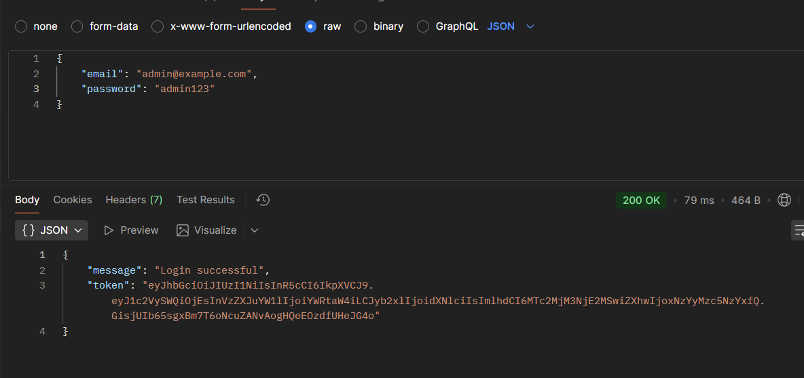
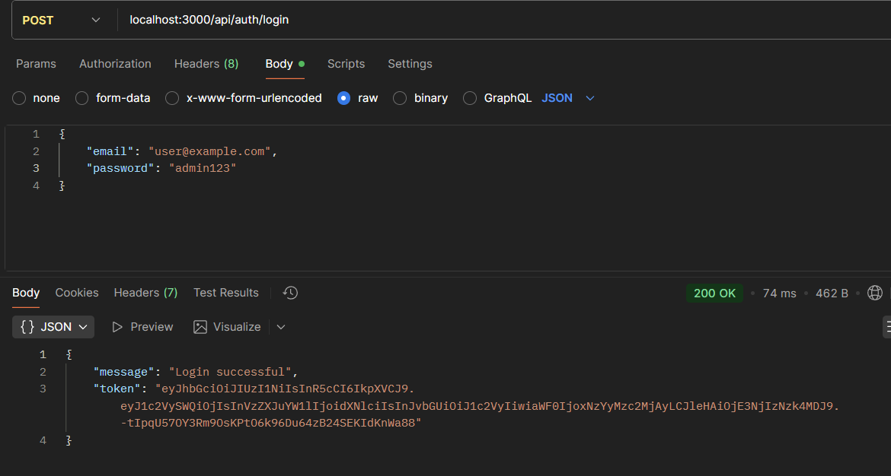
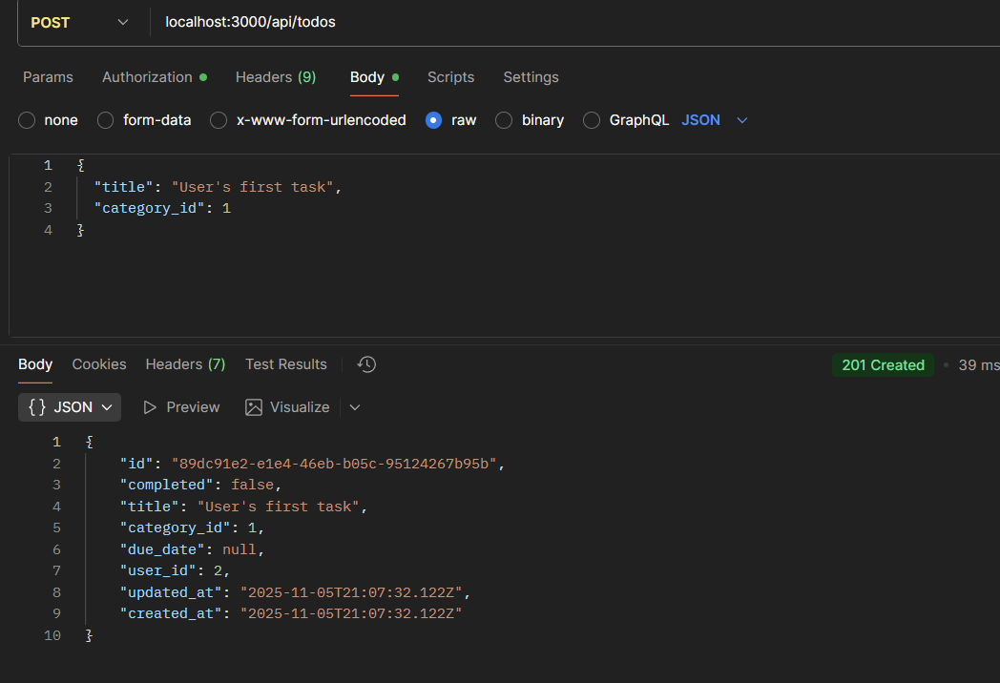
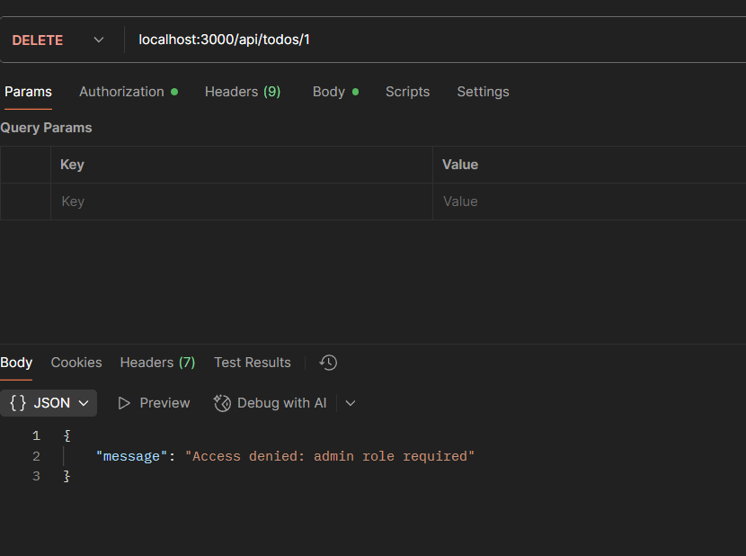
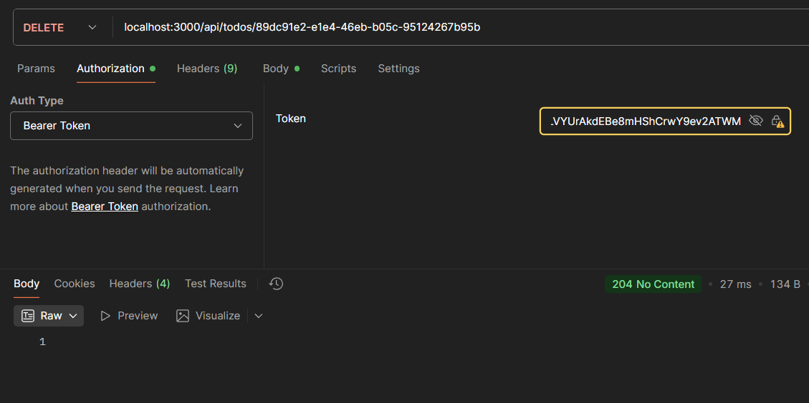

# Лабораторная работа №3. Аутентификация и авторизация
Студент: Алексеев Сергей. <br>
Группа: IA-2303
***
## Цель работы

1. Освоить методы аутентификации и авторизации в backend-приложениях на Node.js.
2. Реализовать защиту REST API с помощью JWT (JSON Web Token).
3. Научиться разграничивать доступ к ресурсам в зависимости от роли пользователя.


### Шаг 1. Структура базы данных

Добавьте новую таблицу `users`, а также связь с таблицей `todos`.


Изменения в таблице `todos`, добавьте поле `user_id` для связи с пользователем-владельцем задачи:

| Поле      | Тип          | Описание                                          |
| --------- | ------------ | ------------------------------------------------- |
| `user_id` | INTEGER (FK) | Внешний ключ на таблицу `users` (владелец задачи) |

### Шаг 2. Реализация аутентификации (Authentication)

1. Добавьте маршруты `/api/auth`

   | Метод  | URL                  | Описание                                               | Ответ         |
      | ------ | -------------------- | ------------------------------------------------------ | ------------- |
   | `POST` | `/api/auth/register` | Регистрация нового пользователя                        | `201 Created` |
   | `POST` | `/api/auth/login`    | Вход пользователя (получение JWT)                      | `200 OK`      |
   | `GET`  | `/api/auth/profile`  | Получить информацию о текущем пользователе (по токену) | `200 OK`      |
```js
router.post('/register', );
router.post('/login',);
router.get('/profile',);
```
2. Регистрация (`POST /register`):
   1. Проверьте, что имя пользователя и email уникальныc
   2. Захэшируйте пароль с помощью `bcrypt`.
   3. Создайте пользователя в таблице `users`.
3. Вход (`POST /login`):
   1. Проверьте наличие пользователя и правильность пароля.
   2. Сгенерируйте JWT-токен, содержащий: `userId`, `username`, `role`.
   3. Возвратите токен в ответе.
4. Проверка токена (`GET /profile`):
   1. Токен передаётся в заголовке `Authorization: Bearer <token>`.
   2. Если токен валиден — верните информацию о пользователе.
   3. Если нет — статус `401 Unauthorized`.

### Шаг 3. Реализация авторизации (Authorization)
1. Реализуйте middleware, проверяющее JWT (`auth/auth.middleware.js`)
   1. Если токен отсутствует или невалиден → `401 Unauthorized`.
   2. Если токен валиден → запишите объект пользователя в `req.user`.
```js
module.exports = (req, res, next) => {
   try {
      const authHeader = req.headers['authorization'];

      if (!authHeader || !authHeader.startsWith('Bearer ')) {
         return res.status(401).json({ message: 'Authorization token missing or malformed' });
      }

      const token = authHeader.split(' ')[1];
      const secret = process.env.JWT_SECRET;

      if (!secret) {
         console.error('JWT_SECRET not defined in environment variables');
         return res.status(500).json({ message: 'Server configuration error' });
      }
      const decoded = authMiddleware.verify(token, secret);
      req.user = decoded;

      next();
   } catch (err) {
      console.error('JWT verification error:', err.message);
      return res.status(401).json({ message: 'Invalid or expired token' });
   }
};
```
2. Реализуйте ролевую авторизацию:
   1. Middleware `isAdmin` допускает доступ только пользователям с ролью "admin".
```js
exports.isAdmin = (req, res, next) => {
    try {
        if (!req.user) {
            return res.status(401).json({ message: 'Unauthorized: user not found in request' });
        }

        if (req.user.role !== 'admin') {
            return res.status(403).json({ message: 'Access denied: admin role required' });
        }

        next();
    } catch (error) {
        console.error('isAdmin middleware error:', error);
        res.status(500).json({ message: 'Server error' });
    }
};
```
   2. Middleware `isOwnerOrAdmin` допускает доступ, если пользователь — владелец ресурса или администратор.
```js
exports.isOwnerOrAdmin = (getOwnerId) => {
    return async (req, res, next) => {
        try {
            if (!req.user) {
                return res.status(401).json({ message: 'Unauthorized: user not found in request' });
            }

            if (req.user.role === 'admin') {
                return next();
            }

            const ownerId = await getOwnerId(req);
            if (!ownerId) {
                return res.status(404).json({ message: 'Resource not found' });
            }
            if (req.user.userId !== ownerId) {
                return res.status(403).json({ message: 'Access denied: not your resource' });
            }

            next();
        } catch (error) {
            console.error('isOwnerOrAdmin middleware error:', error);
            res.status(500).json({ message: 'Server error' });
        }
    };
};
```

_Политика действий по ролям_:

- _Обычный пользователь_ (`role=user`):
   - Создание задач (POST `/api/todos`)
   - Просмотр задач (GET `/api/todos`)
- _Администратор_ (`role=admin`):
   - Полный доступ ко всем задачам (CRUD на `/api/todos`)
   - Управление категориями (CRUD на `/api/categories`)
```js
const express = require('express');
const router = express.Router();
const todoController = require('../controllers/todoController');
const validate = require('../middleware/validate');
const {createTodoValidator, updateTodoValidator} = require('../validators/todoValidator');
const auth = require('../middleware/auth/auth.middleware.js');
const {isOwnerOrAdmin} = require('../middleware/role.middleware');
const {Todo} = require('../models');

router.get('/',
        auth,
        async (req, res) => {
           try {
              if (req.user.role === 'admin') {
                 const todos = todoController.getAllTodos(req, res);
                 return res.json(todos);
              }

              const todos = await Todo.findAll({where: {user_id: req.user.userId}});
              res.json(todos);
           } catch (error) {
              res.status(500).json({message: 'Server error'});
           }
        }
);

router.get('/:id', todoController.getTodoById);

// Only auth users can create task
router.post('/',
        auth,
        createTodoValidator,
        validate,
        todoController.createTodo
);

router.put('/:id',
        auth,
        updateTodoValidator,
        isOwnerOrAdmin(async (req) => {
           const todo = await Todo.findByPk(req.params.id);
           return todo ? todo.user_id : null;
        }),
        validate,
        todoController.updateTodo);

router.delete('/:id',
        auth,
        isOwnerOrAdmin(async (req) => {
           const todo = await Todo.findByPk(req.params.id);
           return todo ? todo.user_id : null;
        }),
        todoController.deleteTodo
);

module.exports = router;
```

### Шаг 6. Проверка и демонстрация
1. Зарегистрируйте двух пользователей:
   1. `admin@example.com` с ролью `admin`
   
   2. `user@example.com` с ролью `user`
   
2. Войдите и получите JWT для каждого.


3. Проверьте следующие сценарии:
   1. user выполняет `POST /api/todos` — успешно.
   
   2. user выполняет `DELETE /api/todos/:id` — получает `403 Forbidden`
   
   3. admin выполняет `PUT/DELETE` на любую задачу или категорию → успех (`200/204`).
   
