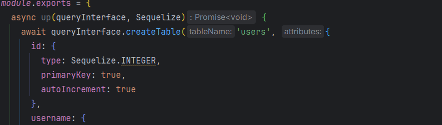
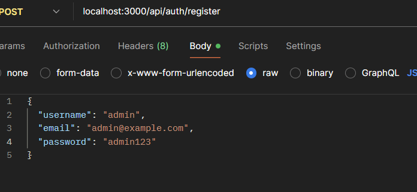
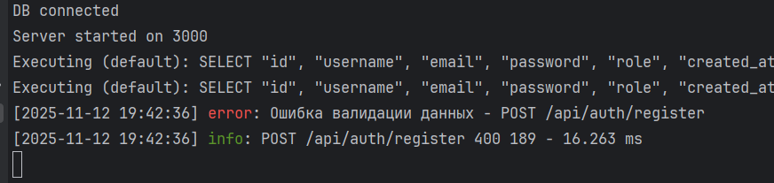

# Лабораторная работа №4. Обработка ошибок, валидация и логгирование
Студент: Алексеев Сергей. <br>
Группа: IA-2303
***
## Цель работы

Целью данной лабораторной работы является изучение методов обработки ошибок, валидации данных и логгирования в приложениях на Node.JS с использованием Express.

### Шаг 1. Обработка ошибок

1. Реализуйте централизованный обработчик ошибок в вашем приложении Express.
   - Рекомендуется создать пользовательские классы ошибок для различных типов ошибок (например, `NotFoundError`, `ValidationError`, `DatabaseError` и т.д.).
```js
class AppError extends Error {
   constructor(message, statusCode = 500) {
      super(message);
      this.statusCode = statusCode;
      this.status = 'error';
   }
}

class NotFoundError extends AppError {
    constructor(message = 'Resource not found') {
        super(message, 404);
    }
}

class ValidationError extends AppError {
    constructor(message = 'Validation failed') {
        super(message, 400);
    }
}

class DatabaseError extends AppError {
    constructor(message = 'Database error') {
        super(message, 500);
    }
}

```
2. Все ошибки должны корректно перехватываться и преобразовываться в унифицированный формат ответа клиенту:
   ```json
   {
     "status": "error",
     "message": "Описание ошибки"
   }
   ```
3. Для асинхронных маршрутов рекомендуется использовать подход, который предотвращает "потерю" ошибок, например, обертка над async-функциями.
```js
module.exports = function asyncHandler(fn) {
    return (req, res, next) => {
        Promise.resolve(fn(req, res, next))
            .catch(next);
    };
}
```

### Шаг 2. Валидация данных

1. Используйте библиотеку `express-validator` или `Joi`, добавьте в ваше приложение валидацию входящих данных для всех маршрутов, которые принимают данные от клиента (например, создание или обновление ресурсов).
```js
router.post(
        '/register',
        ...registerUserValidator,
        validate,
        controller.register
);

// Login end-point
router.post(
        '/login',
        ...loginUserValidator,
        validate,
        controller.login
);
```
2. В случае ошибки валидации возвращайте клиенту ответ с кодом состояния `400` и подробным описанием ошибок валидации.
   ```json
   {
     "status": "error",
     "message": "Ошибка валидации данных",
     "errors": [
       {
         "field": "имя_поля",
         "message": "описание ошибки"
       }
     ]
   }
   ```
3. Используйте глобальный обработчик ошибок для обработки ошибок валидации.


### Шаг 3. Логгирование

1. Добавьте в ваше приложение логгирование с использованием библиотеки `winston` или `morgan`.
2. Самостоятельно решите, какие события и ошибки должны логгироваться (например, успешные запросы, ошибки сервера, ошибки валидации и т.д.).
3. Логи должны сохраняться в файл с ротацией (например, с использованием `winston-daily-rotate-file`) или сохранятся в сторонний сервис логгирования (например, Loggly, Papertrail и т.д.).



## Контрольные вопросы

1. Преимущества централизованной обработки ошибок в Express
   1. Упрощает поддержку — все ошибки обрабатываются в одном месте.
   2. Исключает дублирование кода try/catch в каждом маршруте.
   3. Позволяет формировать единый формат ответов клиенту.
   4. Упрощает интеграцию с логированием и системами мониторинга (например, Sentry).
2. Категории логов и почему они выбраны
- Информационные (info) — успешные запросы, запуск сервера.
- Ошибки (error) — исключения, сбои, ошибки валидации и БД.
- Предупреждения (warn) — потенциальные проблемы.
 `Такой выбор помогает отделять нормальную работу приложения от сбоев и быстро находить причины ошибок.`
3. Подходы к валидации данных в Express и какой использован
- Можно валидировать вручную в коде.
- Можно использовать middleware, например express-validator или Joi.
- В проекте использован express-validator для проверки входных данных и вывода ошибок в едином формате JSON.


